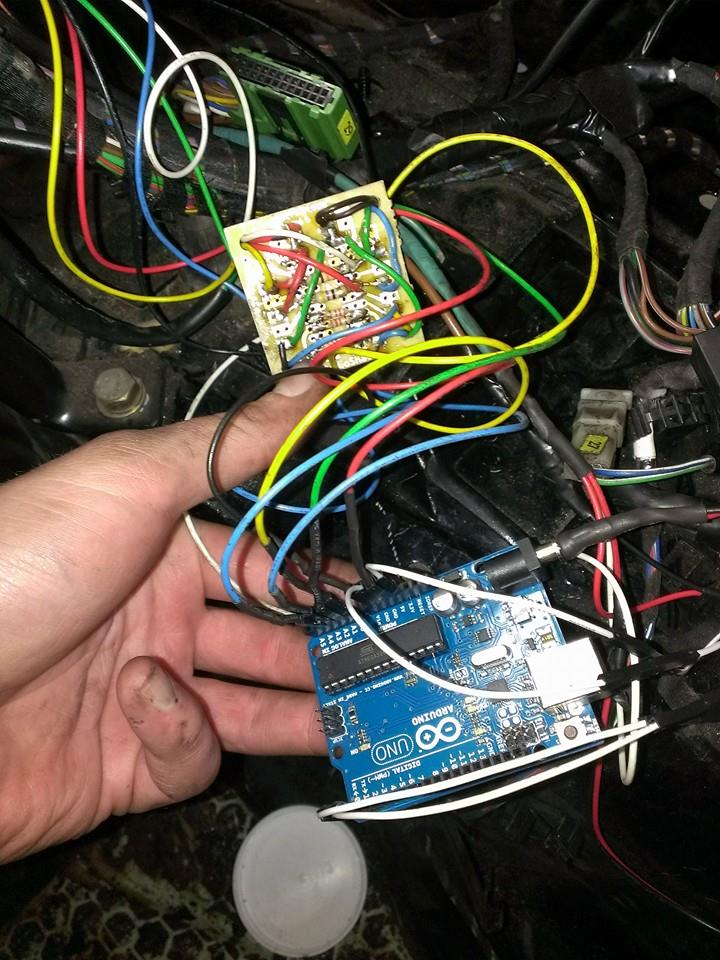

# vsr-gauges

Gauges for race cars get expensive.  They are also hard to read at a glance and do not have a lot of features.  You don't have time to keep staring at a gauge and you only care when something is wrong.  This takes ebay temperature and pressure sensor values read by an arduino and sends them over bluetooth to an android tablet for display.  The entire screen will turn red when values are out of range making it so you never have to look directly at it.

